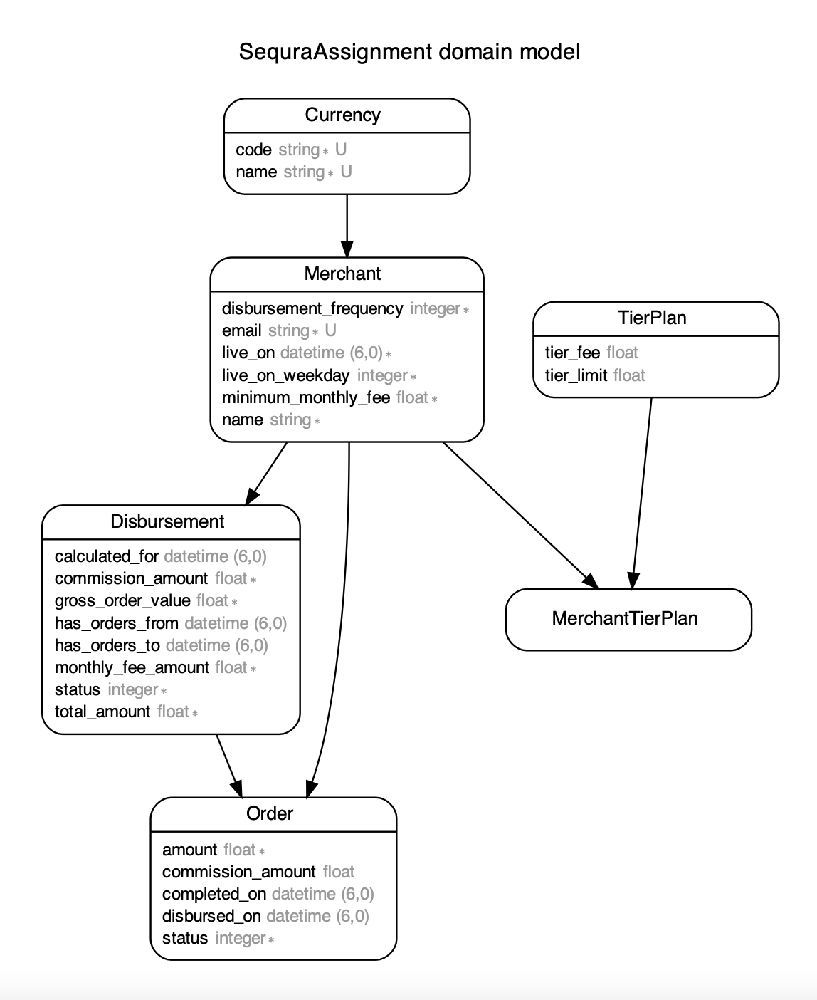

# Sequra Assignment

Detailed problem statement can be found [here](https://sequra.github.io/backend-challenge/)

In summary, I am expected to:

* Create the necessary data structures and a way to persist them for the provided data. You don’t have to follow CSV’s schema if you think another one suits you better.
* Calculate and store the disbursements following described requirements for all the orders included in the CSV, and prepare the system to do the same for new orders.
* Fill the following table and include it in the README with the number and amount of monthly_fees charged yearly from the calculated disbursements. Note that we care about the amounts charged due to the minimum_monthly_fee, meaning the extra that was charged to merchants to get to that configuration.

```
Year | Number of monthly fees charged	| Amount of monthly fee charged                             
2022 |                                  | 
2023 |                                  | 
```

# Submission

## Dependencies

* Ruby - "3.0.4"
* Rails - "~> 7.0.4"
* Postgresql
* Docker
* Rspec
* Redis
* Sidekiq

## What did I implement?
* Created `Order` and `Merchant` tables based on attributes provided in data
* Added `commission_amount` attribute in `Order` table to store per order commission to reduce time in disbursement calculation
* Added `live_on_weekday` attribute in `Merchant` table to query merchants that were got live on particular day of week.
* Created `Tier Plan` table so that multiple type of tiers can be created and merchants can be assigned with any number of tiers
* Created separate `Currency` table.
* Seeding data using CSV parsing. Creating a array of hash in which hash store data for one order record including `commission_amount` and using `insert_all` to bulk populate Order table.
* Created two class methods on `Disbursement` class, `calculate` and `calculate_for_merchant` which accepts collection of merchant and single merchant record respectively along with day for which we need to calculate disbursement.
* Created rake task to run script to calculcate disbursements for all pending orders.
* Main logic for rake task is to group all pending orders based on their creation date and then pick one date, get list of merchants which opt for daily disbursement and merchants which opt for weekly disbursement and who got live on day of week of the falling on chosen date. Pass each collection of merchants along with date to `Disbursement.calculate` which will pass each merchant along with date to `Disbursement.calculate_for_merchant`.
* Each order record has alphanumerical reference to associated disbursement record.
* Created instance methods for disbursement class to determine if disbursement should be use to charge penalty for not hitting minimum monthly fee in commission.
* Created `DisbursementCalculatorJob` which is scheduled to runs At second :00, at minute :59, every 3 hours between hours 03am and 20pm, of every day and calculates disbursement for current day. Used `sidekiq-scheduler` for scheduling. 
* Monthly fee is stores in `monthly_fee_amount` attribute w.r.t each disbursement but not it is not part of final calculated payout
* Retry mechanism with exponential backoff using wait and jitter options in active job's retry_on callback
* Created necessary scopes in `Disbursement`, `Merchant` and `Order` model.
* `Docker`
* Test coverage
* Uses `UUIDs` in-place of IDs
* Filled table that was asked

```
Year | Number of monthly fees charged	| Amount of monthly fee charged                             
2022 | 8                                | 126.35 
2023 | 8                                | 149.51
```

## Assumptions/Edge-cases
* Running recurring job on a regular interval of 3 hours should be enough to cover all pending orders by 8PM UTC
* Only one tier is applicable on an order based on order amount. For example if an order amount to 400 then it'll not be a case that first 50 euro will come under tier 1, next 300 euro will come under tier 2 and last 50 euro will come under tier 3.
* What happens if a completed disbursement (sent to client) already exists for given day when we’re disbursing imported old orders
	* system will create another disbursement with remaining unpaid orders. It’ll not charge monthly_fee_penalty twice as is_first_of_the_month? Will have more than one disbursement records so it'll not be first disbursement of the month

## What's not covered?
* Suppose a merchant with weekly payout option (minimum monthly fee 15 EUR) get disbursed on 27th of month, next payout for this merchant will be in next month. So orders placed on remaining 4 days of month i.e. 28,29,30,31 dates  will be considered in payout for next month. But commission from these orders could’ve help merchant save in monthly fee.

* What happens when a merchant was imported who got older live_on date but never received any order?
	* such merchant is not part of this import so not covered in script. 

## Installation

Note - 1 - You don't need to install rails, ruby, postgresql, redis in your local system if you want to setup project only using docker. After installing docker, See [this](#docker) section to setup project using docker. 

1. Please install Ruby if you don't already have one installed. You can follow steps from following link for the installation.

    https://www.ruby-lang.org/en/documentation/installation/
2. Install Rails

    https://guides.rubyonrails.org/v5.1/getting_started.html#installing-rails
3. Install Postgresql db

    https://www.postgresql.org/download/macosx/
4. Install Docker

    https://www.docker.com/products/docker-desktop/
5 Install Redis and run server. If you're using any other port than 6379 then change port number in sidekiq.rb initializer.

    https://redis.io/docs/getting-started/installation/

## Setup

There are three ways to setup this project.

1. [From source and localhost](#source-and-localhost)
2. [From source and docker](#source-and-docker)

Let me explain each method.

### Source and Localhost
1. Unzip folder and change directory to folder
2. Make sure your local postgresql server is up and running.
3. Run 
    ```
    bundle install
    ```
4. Setup database
    ```
    bin/rails db:setup
    ```

5. Run rails server. 
    ```
    rails s
    ```
6. Your app is up and running on 
    ````bash
    http://127.0.0.1:3000
    ````
7. Run rake script to calculate disbursement for all pending orders
    ```
    rails disbursements:calculate
    ```
8. Run sidekiq server in new terminal tab/window
    ```
    sidekiq
    ```
9. You can see scheduled recurring job on sidekiq client.
    ```
    http://localhost:3000/sidekiq/recurring-jobs
    ```

## Source and docker

NOTE - Docker setup takes very looooooong time on seeding stage. if you already have dependencies setup then please stick with localhost method. 

1. Unzip folder
2. Remove following code from comment in database.yml file
    Host - postgres
    Username - sequra_assignment_app
    Password - password
3. change directory to code folder and run following command.
    ```
    docker compose -f docker-compose.yml -f docker-compose-dev.yml up --build
    ```
4. Above command should run following three containers
    ```
    ad_postgres
    pgadmin4
    sequra_job
    sequra_redis
    sequra-assignment
    ```
5. Run migrations
    ```
    docker-compose run sequra-assignment rake db:migrate
    ```
6. Seed database
    ```
    docker-compose run sequra-assignment rake db:seed
    ```
7. Your app is up and running on 
    ````bash
    http://127.0.0.1:3000
    ````
8. Docker is setup to run pgadmin client. Read [this](#pgadmin-setup) section to know more.
9. Run rake script using below command
    ```
    docker-compose run sequra-assignment rake disbursements:calculate
    ```

### Pgadmin Setup
1. You can access pgadmin web client using following credentials.

    ```
    host: http://localhost:12345/
    email: bittu@test.com
    password: password
    ```
2. Click on `Add new server` and use following configurations in respective tab and `save`
    ```
    - TabName
        Configuration
    - General
        Name - <choose-any-server-name> 
    - Connection
        Host - postgres
        Username - sequra_assignment_app
        Password - password
    ```
3. You should see new server added to left side pan. Expand it and you can access databases. 

# Testing

Application uses [Rspec](https://github.com/rspec/rspec-rails). To run test suits, run below command.

```
bundle exec rspec
```

For more details regarding options and documentation, read [here](https://github.com/rspec/rspec-rails)

# Additional Details


### Database schema


Idea was to design a schema which has flexibility to add and assign new currencies, new tier plans and keep processing time lowest while system is running disbursement calculations.

I also used enums for fields with statis values. Enums are listed below

1. Disbursement
    ```
      enum :status, { in_progress: 0, ready: 1, completed: 2 }, prefix: true
      ```
    Disbursement can't be sent out to client until it is in ready status.

2. Merchant
    ```
    enum :live_on_weekday, { sunday: 0, monday: 1, tuesday: 2, wednesday: 3, thursday: 4, friday: 5, saturday: 6 }, prefix: true
    ```
    ```
    enum :disbursement_frequency, { daily: 0, weekly: 1 }, suffix: true
    ```
3. Order
    ```
      enum :status, { pending: 0, completed: 1 }, prefix: true
    ```

### Improvements
 
 1. More test cases
 2. Faster docker setup for large processing
 3. APIs to fetch disbursement and order metrics
 4. Authentication and Authorization if we implement APIs
 5. state_machine implementation on Order and Disbursement to trigger processing.